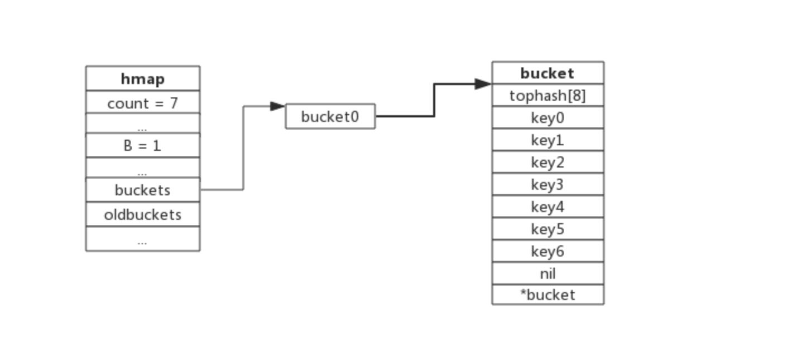
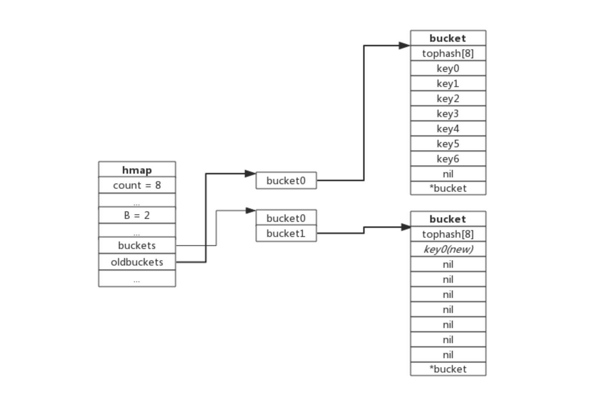
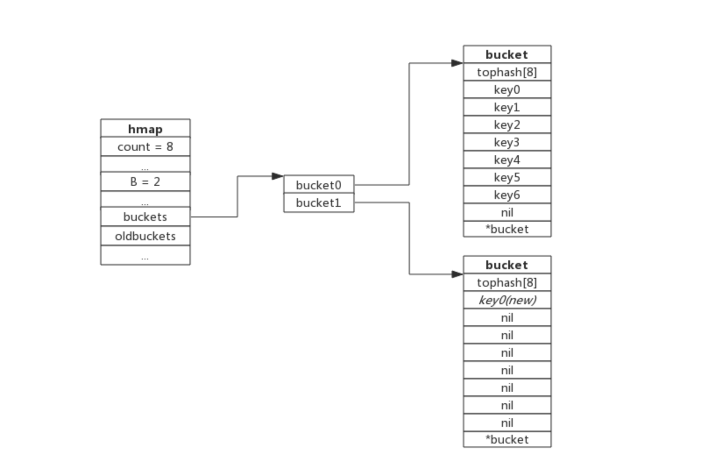
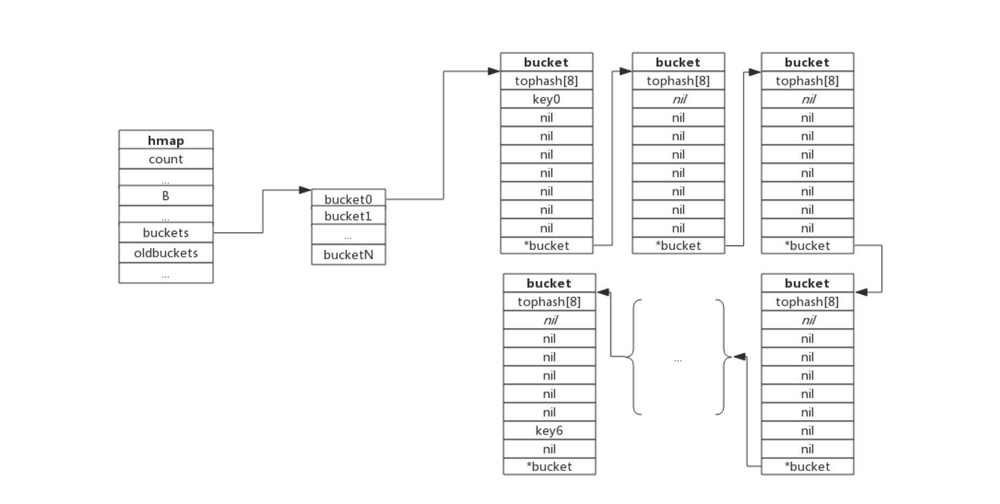

## *一、详解HashMap*
### 1.HashMap


### 1.1 哈希冲突
哈希冲突是指两个值经过哈希算法计算得到的哈希值相同,应该放在同一个槽内,这样就称为哈希冲突。
哈希冲突解决方案:
(1)开放地址法:也称再散列法,其基本思想是当关键字key的哈希地址p=H（key）出现冲突时，以p为基础，产生另一个哈希地址p1，如果p1仍然冲突，再以p为基础，产生另一个哈希地址p2，…，直到找出一个不冲突的哈希地址pi ，将相应元素存入其中。这种方法有一个通用的再散列函数形式：
Hi=（H（key）+di）% m i=1，2，…，n
其中H（key）为哈希函数，m 为表长，di称为增量序列。
包含线性探测再散列(向后查空槽)、二次探测再散列(两侧反复横跳)以及伪随机探测再散列。
(2)再哈希法(新哈希算法)
(3)链地址法(槽拉链表解决)
(4)建立公共溢出区:将哈希表分为基本表和溢出表两部分,凡是和基本表发生冲突的元素一律填入冲突表。

### 1.2 拉链法优缺点
*拉链法的优点*
(1)拉链法处理冲突简单，且无堆积现象，即非同义词决不会发生冲突，因此平均查找长度较短；
(2)由于拉链法中各链表上的结点空间是动态申请的，故它更适合于造表前无法确定表长的情况；
(3)开放定址法为减少冲突，要求装填因子α较小，故当结点规模较大时会浪费很多空间。而拉链法中可取α≥1，且结点较大时，拉链法中增加的指针域可忽略不计，因此节省空间；
(4)在用拉链法构造的散列表中，删除结点的操作易于实现。只要简单地删去链表上相应的结点即可。而对开放地址法构造的散列表，删除结点不能简单地将被删结 点的空间置为空，否则将截断在它之后填人散列表的同义词结点的查找路径。这是因为各种开放地址法中，空地址单元(即开放地址)都是查找失败的条件。因此在 用开放地址法处理冲突的散列表上执行删除操作，只能在被删结点上做删除标记，而不能真正删除结点。
*拉链法的缺点*
指针需要额外的空间，故当结点规模较小时，开放定址法较为节省空间，而若将节省的指针空间用来扩大散列表的规模，可使装填因子变小，这又减少了开放定址法中的冲突，从而提高平均查找速度。

### 1.3 负载因子
负载因子用于衡量一个哈希表的冲突情况,公式如下:
负载因子 = 键数量 / Bucket数量
·哈希表需要控制负载因子在合适大小,超过其阈值就要进行rehash
	哈希因子过小,说明空间利用率低
	哈希因子过大,说明冲突严重,存取率低
·每个哈希表对哈希因子容忍程度不一样
	Redis负载因子大于1会触发Rehash
	Golang负载因子大于6.5时才会触发Rehash
*这是因为Redis的每个Bucket只存一个键值对,而Go的Bucket可能存8个键值对,所以Go可以容忍更高的负载因子*

### 2.Redis HashMap

### 2.2 Hash命令
命令|用途|
--|:--:|
|HDEL key field1 [field2]|删除一个或多个哈希表字段|
|HEXISTS key field|查看哈希表 key 中，指定的字段是否存在|
|HGET key field|获取存储在哈希表中指定字段的值|
|HGETALL key|获取在哈希表中指定 key 的所有字段和值|
|HINCRBY key field increment|为哈希表 key 中的指定字段的整数值加上增量 increment|
|HINCRBYFLOAT key field increment|为哈希表 key 中的指定字段的浮点数值加上增量 increment|
|HKEYS key|获取所有哈希表中的字段|
|HLEN key|获取哈希表中字段的数量|
|HMGET key field1 [field2]|获取所有给定字段的值|
|HMSET key field1 value1 [field2 value2 ]|同时将多个 field-value (域-值)对设置到哈希表 key 中|
|HSET key field value|将哈希表 key 中的字段 field 的值设为 value|
|HSETNX key field value|只有在字段 field 不存在时，设置哈希表字段的值|
|HVALS key|获取哈希表中所有值|
|HSCAN key cursor [MATCH pattern] [COUNT count]|迭代哈希表中的键值对|
	

### 3.Golang HashMap
### 3.1 Map数据结构
Golang的map使用哈希表作为底层实现，一个哈希表里可以有多个哈希表节点，也即bucket，而每个bucket就保存了map中的一个或一组键值对。
Go map在语言底层是通过如下的抽象结构来表征:
```go
type Map struct {
	Key  *Type // Key type
	Elem *Type // Val (elem) type

	Bucket *Type // internal struct type representing a hash bucket
	Hmap   *Type // internal struct type representing the Hmap (map header object)
	Hiter  *Type // internal struct type representing hash iterator state
}
```
其中Key、Elem为Key、Value,由于go map支持多种数据类型,go会在预编译阶段推断具体的数据类型,Bucket是哈希桶,Hmap表征了map底层使用的HashTable的元信息,如当前HashTable中含有的元素数据、桶指针等, Hiter 是用于遍历 go map 的数据结构。

```go
// A header for a Go map.
type hmap struct {
	// Note: the format of the hmap is also encoded in cmd/compile/internal/reflectdata/reflect.go.
	// Make sure this stays in sync with the compiler's definition.
	count     int // # live cells == size of map.  Must be first (used by len() builtin)
	flags     uint8
	B         uint8  // log_2 of # of buckets (can hold up to loadFactor * 2^B items)
	noverflow uint16 // approximate number of overflow buckets; see incrnoverflow for details
	hash0     uint32 // hash seed

	buckets    unsafe.Pointer // array of 2^B Buckets. may be nil if count==0.
	oldbuckets unsafe.Pointer // previous bucket array of half the size, non-nil only when growing
	nevacuate  uintptr        // progress counter for evacuation (buckets less than this have been evacuated)

	extra *mapextra // optional fields
}

type bmap struct {
    tophash [8]uint8 //存储哈希值的高8位
    data    byte[1]  //key value数据:key/key/key/.../value/value/value...
    overflow *bmap   //溢出bucket的地址
}
```

### 3.2 ReHash渐进式扩容

### 3.2.1 扩容前提条件
为了保证访问效率，当新元素将要添加进map时，都会检查是否需要扩容，扩容实际上是以空间换时间的手段。 触发扩容的条件有二个：
(1)负载因子 > 6.5时，也即平均每个bucket存储的键值对达到6.5个。
(2)overflow数量 > 2^15时，也即overflow数量超过32768时。

### 3.2.2 增量扩容
当负载因子过大时，就新建一个bucket，新的bucket长度是原来的2倍，然后旧bucket数据搬迁到新的bucket。 考虑到如果map存储了数以亿计的key-value，一次性搬迁将会造成比较大的延时，Go采用逐步搬迁策略，即每次访问map时都会触发一次搬迁，每次搬迁2个键值对。

下图展示了包含一个bucket满载的map(为了描述方便，图中bucket省略了value区域):


当前map存储了7个键值对，只有1个bucket。此地负载因子为7。再次插入数据时将会触发扩容操作，扩容之后再将新插入键写入新的bucket。

当第8个键值对插入时，将会触发扩容，扩容后示意图如下：


hmap数据结构中oldbuckets成员指身原bucket，而buckets指向了新申请的bucket。新的键值对被插入新的bucket中。 后续对map的访问操作会触发迁移，将oldbuckets中的键值对逐步的搬迁过来。当oldbuckets中的键值对全部搬迁完毕后，删除oldbuckets。

搬迁完成后的示意图如下：

数据搬迁过程中原bucket中的键值对将存在于新bucket的前面，新插入的键值对将存在于新bucket的后面。 实际搬迁过程中比较复杂，将在后续源码分析中详细介绍。

### 3.2.3 等量扩容
所谓等量扩容，实际上并不是扩大容量，buckets数量不变，重新做一遍类似增量扩容的搬迁动作，把松散的键值对重新排列一次，以使bucket的使用率更高，进而保证更快的存取。 在极端场景下，比如不断的增删，而键值对正好集中在一小部分的bucket，这样会造成overflow的bucket数量增多，但负载因子又不高，从而无法执行增量搬迁的情况，如下图所示：


上图可见，overflow的buckt中大部分是空的，访问效率会很差。此时进行一次等量扩容，即buckets数量不变，经过重新组织后overflow的bucket数量会减少，即节省了空间又会提高访问效率。
## *二、用Golang实现HashMap*


## hash底层
## redis hash && golang map->并发安全
## rehash

```go
package main

import (
	"fmt"
	"math/rand"
	"time"
)

const (
	initSize = 1 << 4 //哈希数组初始大小
)

type HashKey interface {
	GetHash(mod int) int//哈希函数
}

type HashNode struct {
	key   HashKey
	value interface{}
	next  *HashNode
}

type HashMap struct {
	nodes []*HashNode//哈希数组
	total int //当前元素数量
}

func (h *HashMap) init() {
	h.nodes = make([]*HashNode, initSize)//初始化哈希数组
	h.total = 0
}

func NewHashMap() *HashMap {
	mp := &HashMap{}
	mp.init()
	return mp
}

func (h *HashMap) Get(key HashKey) (value interface{}, ok bool) {
	i := key.GetHash(cap(h.nodes))//计算hashcode
	for head := h.nodes[i]; head != nil; head = head.next {//遍历hashcode对应的链表
		if head.key == key {
			ok = true
			value = head.value
			break
		}
	}

	return
}

func (h *HashMap) Set(key HashKey, value interface{}) {
	i := key.GetHash(cap(h.nodes))//计算hashcode
	for head := h.nodes[i]; head != nil; head = head.next {//遍历hashcode对应的链表
		if head.key == key {
			// key存在，替换value
			head.value = value
			return
		}
	}
	// key不存在，插入
	h.nodes[i] = &HashNode{
		key:   key,
		value: value,
		next:  h.nodes[i],
	}

	h.total++
	if h.total == cap(h.nodes) {//当前元素数量等于哈希数组的容量，扩容
		h.remake()
	}
}

func (h *HashMap) remake() {
	capa := cap(h.nodes) << 1           //容量翻倍
	newNodes := make([]*HashNode, capa) //新的hash数组
	for _, v := range h.nodes {         //遍历旧hash数组
		for ; v != nil; v = v.next {
			index := v.key.GetHash(capa)//重新计算哈希值
			newNodes[index] = &HashNode{//建立新链表
				key:   v.key,
				value: v.value,
				next:  newNodes[index],
			}
		}
	}
	h.nodes = newNodes
}

type KeyType struct {
	string
}

func (h KeyType) GetHash(mod int) (hashCode int) {//实现一个对string的哈希函数
	for _, v := range h.string {
		a := int(v)
		hashCode = (hashCode*31 + a) & (mod - 1) //mod是2的幂，直接用与代替模
	}
	return
}


//以下为测试代码
func GetRandomString(l int) string {
	str := "0123456789abcdefghijklmnopqrstuvwxyz"
	bytes := []byte(str)
	result := []byte{}
	r := rand.New(rand.NewSource(time.Now().UnixNano()))
	for i := 0; i < l; i++ {
		result = append(result, bytes[r.Intn(len(bytes))])
	}
	return string(result)
}

type cases struct {
	k, v string
}

func main() {
	mp := make(map[string]interface{}, 16)
	myMp := NewHashMap()
	n := 200000

	c := make([]cases, n)
	cc := make([]KeyType, n)
	for i := 0; i < n; i++ {
		k, v := GetRandomString(10), GetRandomString(10)
		c[i] = cases{k: k, v: v}
		cc[i] = KeyType{string: k}
	}
	st1 := time.Now().Nanosecond()
	for i := 0; i < n; i++ {
		mp[c[i].k] = c[i].v
	}
	st2 := time.Now().Nanosecond()
	for i := 0; i < n; i++ {
		myMp.Set(cc[i], c[i].v)
	}
	st3 := time.Now().Nanosecond()
	//fmt.Printf("%+v", myMp)
	for i := 0; i < n; i++ {
		_, _ = mp[c[i].k]
	}
	st4 := time.Now().Nanosecond()
	for i := 0; i < n; i++ {
		_, _ = myMp.Get(cc[i])

		// if ok2 == false || v2 != v1 {	//验证正确性
		// 	fmt.Println(v1)
		// 	fmt.Println(v2)
		// 	panic("bug!!!")
		// }
	}
	st5 := time.Now().Nanosecond()
	fmt.Printf("standard map insert: %dms\n", (st2-st1)/1000000)
	fmt.Printf("my map insert: %dms\n", (st3-st2)/1000000)
	fmt.Printf("standard map find: %dms\n", (st4-st3)/1000000)
	fmt.Printf("my map find: %dms\n", (st5-st4)/1000000)

}

```