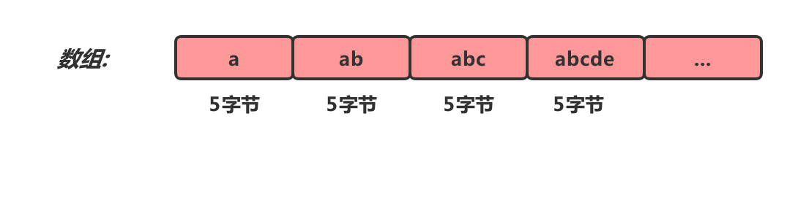
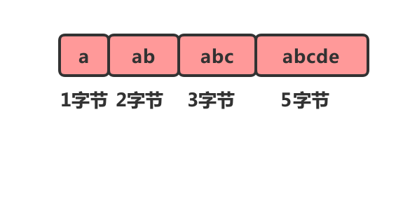
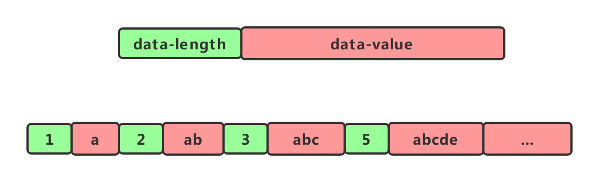
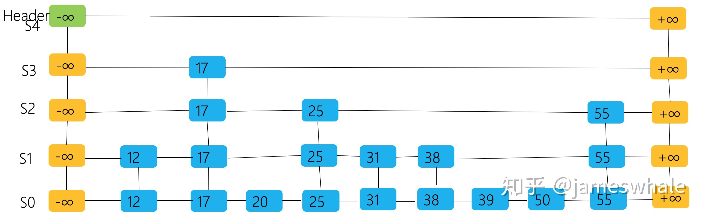

## **一、Redis Sorted Set基础**
### 1.Redis
Redis是key-value类型的nosql,底层共有五种数据结构类型,分别为String、Hash、Set、Sorted Set、List,常见应用场景如下
*string*:缓存、原子计数器作限流
*hash*:存储币种汇率
*set*:微博用户关注、粉丝集合,轻松实现并交集运算
*sorted set*:有序集合,微博热搜排行榜
*list*:链表,轻松实现最新消息排行功能,或是用于消息队列

在Redis中,任意一个对象都有五种属性
*type*:基本数据类型
*encoding*:编码,编码方式决定了对象底层的数据结构,一个对象至少有两种编码方式
*prt*:指针,指向由编码决定的数据结构
*refcount*:引用计数,往往用于redis的内存回收
*lru*:最近最少使用算法

### 2.Sorted Set
Sorted Set的底层可由ZipList(压缩表)和SkipList(跳跃表)实现,只有满足有序集合保存元素小于128个以及有序集合保存的所有元素长度小于64字节两个条件时才能使用ZipList数据结构。
Redis 有序集合和集合一样也是 string 类型元素的集合,且不允许重复的成员,不同的是每个元素都会关联一个 double 类型的分数。redis 正是通过分数来为集合中的成员进行从小到大的排序。
有序集合的成员是唯一的,但分数(score)却可以重复。
集合是通过哈希表实现的,所以添加,删除,查找的复杂度都是 O(1)。 集合中最大的成员数为 232 - 1 (4294967295, 每个集合可存储40多亿个成员)。

### 2.1 ZipList
ZipList是为了节约内存而设计的由一系列特殊编码的连续内存块组成的顺序性数据结构,这样在查询数据的时候可以利用CPU的缓存访问数据,加快查询效率。一个压缩列表可以包含多个节点,每个节点可以保存一个字节数组或者一个整数值。相较于数组而言,数组要求每个元素的大小都要相同,如果我们要存储不定长的元素,这样会造成大量的资源浪费。


ZipList就是根据每个节点的长度来决定占用内存大小,这样每次添加元素时就可以计算下一个节点在内存中的存储位置,从而形成一个压缩列表。压缩列表同时也是列表和哈希的底层实现之一。
当一个列表只包含少量列表项,并且每个列表项要么就是小整数值,要么就是长度比较短的字符串,那么Redis就会使用压缩列表来做列表的底层实现。
当一个哈希只包含少量键值对,比且每个键值对的键和值要么就是小整数值,要么就是长度比较短的字符串,那么Redis就会使用压缩列表来做哈希的底层实现。

但是有一个问题,我们在遍历它的时候并不知道每个元素的大小,因此无法计算出下一个节点的具体位置,这个时候我们可以给每个元素添加一个长度属性。


ZipList数据结构如下:

*zlbytes*:记录整个压缩列表占用的内存字节数,在压缩列表内存重分配,或者计算zlend的位置时使用
*zltail*:记录压缩列表表尾节点距离压缩列表的起始地址有多少字节,通过该偏移量,可以不用遍历整个压缩列表就可以确定表尾节点的地址
*zllen*:记录压缩列表包含的节点数量,但该属性值小于UINT16_MAX（65535）时,该值就是压缩列表的节点数量,否则需要遍历整个压缩列表才能计算出真实的节点数量
*entryX*:压缩列表的节点
*zlend*:特殊值0xFF（十进制255）,用于标记压缩列表的末端

ZipList节点数据结构如下:

*previous_entry_ength*:记录压缩列表前一个字节的长度
*encoding*:节点的encoding保存的是节点的content的内容类型
*content*:content区域用于保存节点的内容,节点内容类型和长度由encoding决定

*为什么只有在列表键比较小的时候才使用压缩列表?*
ziplist 是连续存储的数据结构,内存是没有冗余的,也就是说,每一次新增节点,都需要进行内存申请,然后将如果当前内存连续块够用,那么将新节点添加,如果申请到的是另外一块连续内存空间,那么需要将所有的内容拷贝到新的地址。也就是说,每一次新增节点,都需要内存分配,可能还需要进行内存拷贝。当 ziplist 中存储的值太多,内存拷贝将是一个很大的消耗。所以,Redis 只在一些数据量小的场景下使用 ziplist。

[redis底层数据结构（3）压缩列表](https://www.cnblogs.com/ttaylor/p/15626413.html)
[数据结构与对象（六种底层数据结构）——压缩链表](https://blog.csdn.net/qq_35655602/article/details/116428954)

### 2.2 SkipList
跳表（Skiplist）是一个特殊的链表,相比一般的链表,有更高的查找效率,可比拟二叉查找树,平均期望的查找、插入、删除时间复杂度都是O(logn),最坏的情况下是O(N),许多知名的开源软件（库）中的数据结构均采用了跳表这种数据结构。
*Redis中的有序集合zset*
*LevelDB、RocksDB、HBase中Memtable*
*ApacheLucene中的TermDictionary、Posting List*

跳表是有序集合的底层实现之一,跳跃表是基于多指针有序链表实现的,可以看成多个有序链表,在查找时,从上层指针开始查找，找到对应区间再到下一层去找。

跳表结构如下:


*与红黑树相比,跳跃表有以下优点?*
(1)插入速度非常快速,因为不需要进行旋转等操作来维护平衡性
(2)更容易实现
(3)支持无锁操作

### 2.3 Sorted Set命令
命令|用途|
--|:--:|
|ZADD key score1 member1 [score2 member2]|向有序集合添加一个或多个成员,或者更新已存在成员的分数|
|ZCARD key|获取有序集合的成员数|
|ZCOUNT key min max|计算在有序集合中指定区间分数的成员数|
|ZINCRBY key increment member|有序集合中对指定成员的分数加上增量 increment|
|ZINTERSTORE destination numkeys key [key ...]|计算给定的一个或多个有序集的交集并将结果集存储在新的有序集合 destination 中|
|ZLEXCOUNT key min max|在有序集合中计算指定字典区间内成员数量|
|ZRANGE key start stop [WITHSCORES]|通过索引区间返回有序集合指定区间内的成员|
|ZRANGEBYLEX key min max [LIMIT offset count]|通过字典区间返回有序集合的成员|
|ZRANGEBYSCORE key min max [WITHSCORES] [LIMIT]|通过分数返回有序集合指定区间内的成员|
|ZRANK key member|返回有序集合中指定成员的索引|
|ZREM key member [member ...]|移除有序集合中的一个或多个成员|
|ZREMRANGEBYLEX key min max|移除有序集合中给定的字典区间的所有成员|
|ZREMRANGEBYRANK key start stop|移除有序集合中给定的排名区间的所有成员|
|ZREMRANGEBYSCORE key min max|移除有序集合中给定的分数区间的所有成员|
|ZREVRANGE key start stop [WITHSCORES]|返回有序集中指定区间内的成员,通过索引,分数从高到低|
|ZREVRANGEBYSCORE key max min [WITHSCORES]|返回有序集中指定分数区间内的成员,分数从高到低排序|
|ZREVRANK key member|返回有序集合中指定成员的排名,有序集成员按分数值递减(从大到小)排序|
|ZSCORE key member|返回有序集中,成员的分数值|
|ZUNIONSTORE destination numkeys key [key ...]|计算给定的一个或多个有序集的并集,并存储在新的 key 中|
|ZSCAN key cursor [MATCH pattern] [COUNT count]|迭代有序集合中的元素（包括元素成员和元素分值）|

## **二、Golang实现ZipList**
```go
type ZipList struct {

}

type Node struct {

}
```

## **三、Golang实现SkipList**

```go
package engine

import (
	"bytes"
	"math/rand"
)

type SkipList struct {
	maxLevel        int
	length          int
	probability     float64
	probabilityList []float64
	randomGenerator rand.Source
	head            []*Node //每一行的头指针
	previousCache   []*Node //每一行key比当前key小的node, 插入时使用
}

type Node struct {
	key   []byte
	value interface{}
	next  *Node
	prev  *Node // 只在level0使用
	down  *Node
}

func (n *Node) Next() Iterator {
	return n.next
}

func (n *Node) Prev() Iterator {
	return n.prev
}

func (n *Node) Value() interface{} {
	return n.value
}

func (n *Node) Key() []byte {
	return n.key
}

func NewSkipList(maxLevel int, probability float64, randomGenerator rand.Source) *SkipList {
	if probability >= 1 {
		panic("invalid probability")
	}
	probabilityList := make([]float64, maxLevel)
	probabilityList[0] = 1
	for i := 1; i < maxLevel; i++ {
		probabilityList[i] = probabilityList[i-1] * probability
	}
	head := make([]*Node, maxLevel)
	head[0] = &Node{}
	for i := 1; i < maxLevel; i++ {
		head[i] = &Node{
			down: head[i-1],
		} //head要分配内存,previousCache直接存指针,不用分配内存
	}

	return &SkipList{
		maxLevel:        maxLevel,
		length:          0,
		probability:     probability,
		probabilityList: probabilityList,
		randomGenerator: randomGenerator,
		head:            head,
		previousCache:   make([]*Node, maxLevel),
	}
}

func NewDefaultSkipList() *SkipList {
	return NewSkipList(20, float64(1)/3, rand.NewSource(rand.Int63()))
}

// randomLevel return level in [1, maxLevel]
func (sl *SkipList) randomLevel() (level int) {
	r := float64(sl.randomGenerator.Int63()) / (1 << 63)

	level = 1
	for level < sl.maxLevel && r < sl.probabilityList[level] {
		level++
	}
	return level
}

func (sl *SkipList) previousNodes(key []byte) []*Node {
	cache := sl.previousCache
	prev := sl.head[sl.maxLevel-1] //prev.key是当前level中小于key的最大的key
	var now *Node
	for i := sl.maxLevel - 1; i >= 0; i-- {
		now = prev.next
		for now != nil && bytes.Compare(key, now.key) > 0 {
			prev = now
			now = now.next
		}
		cache[i] = prev
		prev = prev.down
	}
	return cache
}

func (sl *SkipList) Set(key []byte, value interface{}) *Node {
	prevs := sl.previousNodes(key)
	if nxt := prevs[0].next; nxt != nil && bytes.Equal(nxt.key, key) {
		//存在,直接修改value
		nxt.value = value
		return nxt
	}

	level := sl.randomLevel()
	nodes := make([]*Node, level)
	nodes[0] = &Node{
		key:   key,
		value: value,
		prev:  prevs[0],
		next:  prevs[0].next,
	}
	prevs[0].next = nodes[0]

	for i := 1; i < level; i++ {
		nodes[i] = &Node{
			key:  key,
			next: prevs[i].next,
			down: nodes[i-1],
		}
		prevs[i].next = nodes[i]
	}
	sl.length++
	return nodes[0]
}

func (sl *SkipList) Get(key []byte) Iterator {
	now := sl.head[sl.maxLevel-1]
	for i := sl.maxLevel - 1; i > 0; i-- {
		for now.next != nil && bytes.Compare(now.next.key, key) < 0 {
			now = now.next
		}
		now = now.down
	}
	for now != nil && bytes.Compare(now.key, key) < 0 {
		now = now.next
	}
	if now != nil && bytes.Equal(now.key, key) {
		return now
	}
	return nil
}

func (sl *SkipList) GetRange(left, right *[]byte) (begin Iterator, end Iterator) {
	return
}
```