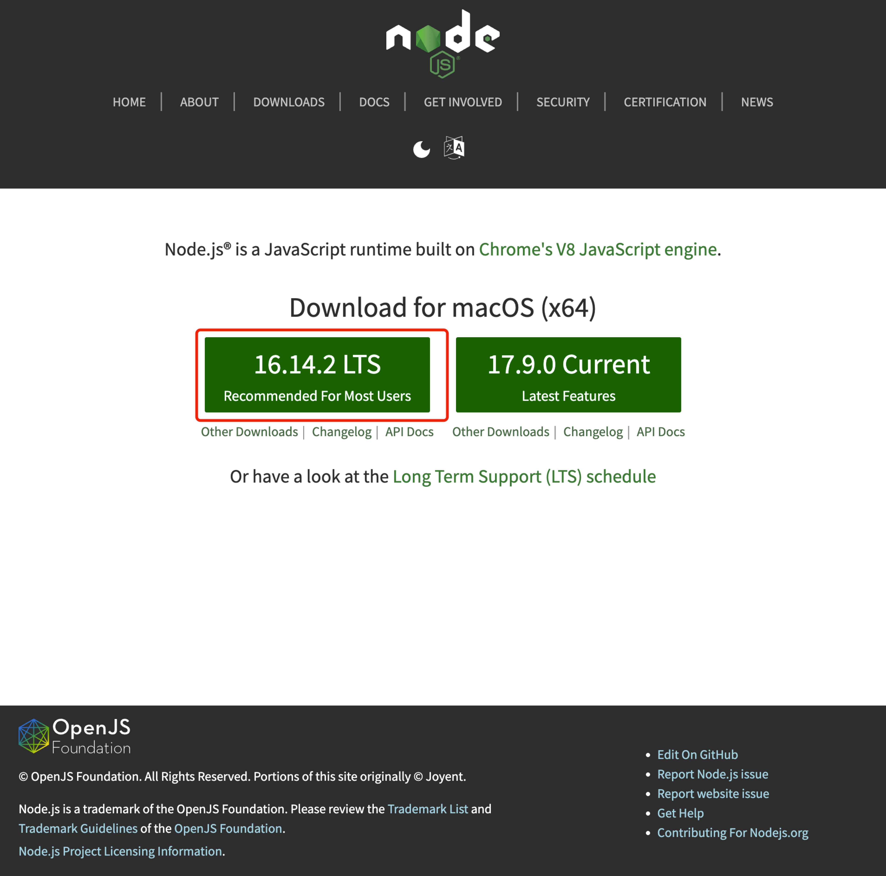

## **一、使用github创个人博客网站**
### 1.新建仓库
### 2.更改仓库Settings下的Page


## **二、使用Hexo搭建个人博客网站**
### 1.前言
Hexo是一个快速、简洁且高效的博客框架。Hexo 使用 Markdown（或其他渲染引擎）解析文章，在几秒内，即可利用靓丽的主题生成静态网页。即把用户的markdown文件，按照指定的主题解析成静态网页。
### 2.安装Hexo
安装使用hexo之前需要先安装Node.js和Git，当已经安装了Node.js和npm可以通过以下命令安装hexo
```
$npm install -g hero-cli
```

可通过以下命令查看主机是否安装了node.js和npm
```
$node —version
$npm —version
```


### 2.1.Mac安装Node.js步骤如下
#### 2.1.1下载
点击[官网](https://nodejs.org/en/),选择LTS版本下载


#### 2.2.2安装


#### 2.2.3验证
$node —version
$npm —version

#### 2.2.4配置
$vim .bash_profile
添加最后两行配置


### 3.新建项目
安装完Hexo后,执行以下命令:
```
$hexo init <folder>
$cd <folder>
$npm install
```
新建完成后,指定目录中的情况如下
.
├── _config.yml
├── package.json
├── scaffolds
├── source
|   ├── _drafts
|   └── _posts
└── themes
之后将此文件关联到github仓库,修改_config.yml里的deploy配置如下:

执行以下命令,即可推送部署到github.io
```
$hexo deploy --generate
$hexo server -p 5000 #本地查看效果
```
访问[个人github.io网站](https://pppeng3.github.io/)即可


#### 3.1 修改主题
该网站使用的是insulin主题配色,更改步骤如下,先下载该项目主题,之后解压到自己项目的thems文件夹下,将_config.yml内的themes配置从默认的landscape改为insulin即可
```$ git clone https://github.com/kb1000fx/hexo-theme-insulin```
insulin主题设置可参考[详细教程](https://garybear.cn/hexo-theme-insulin/#/),[其他主题](https://hexo.io/themes/)可从官网进行下载
之后得到网站页面如下:


#### 3.2 hexo命令
参考[官方教程](https://hexo.io/zh-cn/docs/commands)